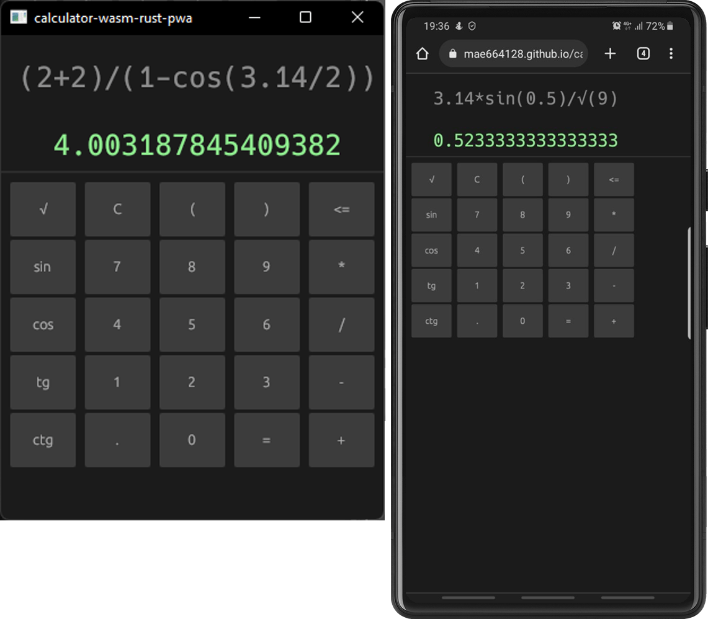

# Простой калькулятор, созданный для демонстрации того, как работать с веб-интерфейсом на ржавчине.

### Инструкция: [тут](tutorial/tutorial.md).

### Демонстрация: [тут](https://mae664128.github.io/calculator-wasm-rust-pwa/).

Пример написания [PWA](https://en.wikipedia.org/wiki/Progressive_web_app) приложения 
готового для использования как в браузере, 
так и на компьютере с ОС Windows. 
Использовался язык программирования Rust и фреймворк 
eframe ([egui](https://github.com/emilk/egui#quick-start)). 
Готовое приложение доступно как исполняемый файл для ОС Windows, 
и как файл Webassembly. 
В процессе работы использовался GitHub Action для 
отслеживания корректности написания нашего кода и сборки исполняемых 
файлов программы, а также для развертывания 
(версию программы с использованием Webassembly) как 
страницы в интернете (GitHub Pages). 