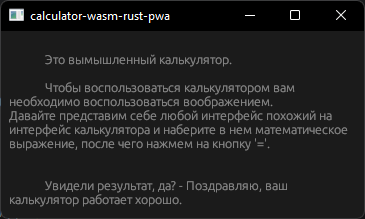
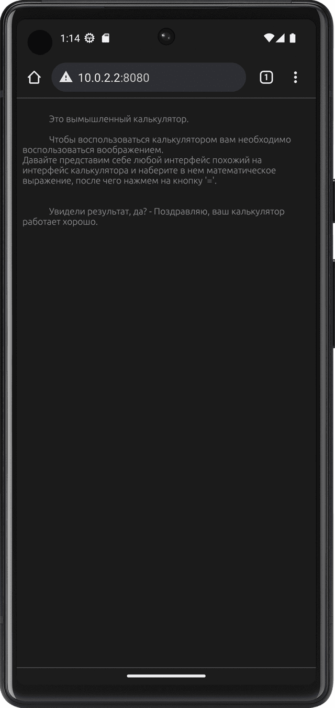
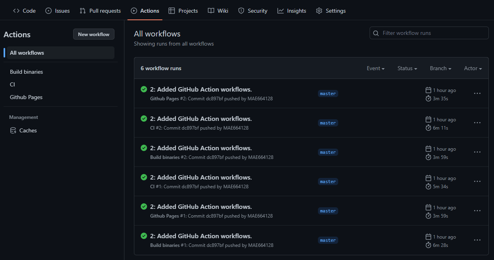
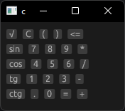
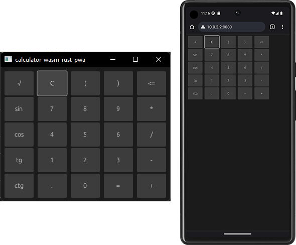
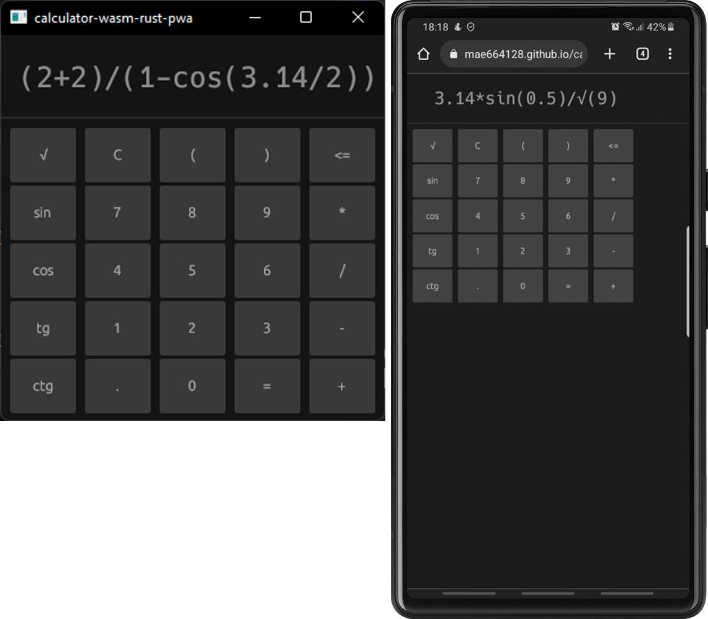

Ниже будет приведен пример написания [PWA](https://en.wikipedia.org/wiki/Progressive_web_app) приложения готового для использования как в браузере, так и на компьютере с ОС Windows. Использовать будем язык программирования Rust и фреймворк eframe ([egui](https://github.com/emilk/egui#quick-start)). Готовое приложение будет доступно как исполняемый файл для ОС Windows, и как файл Webassembly. В процессе работы мы будем использовать GitHub Action для отслеживания корректности написания нашего кода и сборки исполняемых файлов программы, а также для развертывания (версию программы с использованием Webassembly) как страницы в интернете (GitHub Pages). 


## Мотивация автора 

В свободное от работы время, иногда, я занимаюсь тем, что смотрю в сторону разных языков программирования и их экосистем. Последнее время, в мой фокус внимания попал язык программирования Rust. И продолжая знакомиться с экосистемой RUST, я подошел к изучению инструментов для построения пользовательских графических интерфейсов.  Нужно сказать, что я был очень сильно удивлен. Удивлен как в положительном ключе, так и в отрицательном.

Что порадовало:

- доступно очень [много](https://www.areweguiyet.com/) библиотек и фреймворков для создания GUI, как полностью написанных на rust, так и оберток вокруг других инструментов, написанных на других языках;

- многие из них доступны для кроссплатформенной разработки, включая возможность компилировать свое приложение в [WASM](https://en.wikipedia.org/wiki/WebAssembly) и опубликовать его как веб-страницу.

Что расстроило:

- опять же, доступно очень много библиотек и фреймворков для создания GUI и почти все они говорят, что не готовы для использования и носят экспериментальных характер (пример является проект [Druid](https://github.com/linebender/druid), основная команда которого прекратила работу над ним и сосредоточилась над новым проектом [Xilem](https://github.com/linebender/xilem)). Да, последний проект тоже еще не стабилен.

Самое ключевое, что привлекло мое внимание - это возможность компилировать приложение в [WASM](https://en.wikipedia.org/wiki/WebAssembly) и опубликовать его как веб-страницу. "Тренд завтрашнего или вчерашнего дня" - подумал я, так или иначе нужно посмотреть в эту сторону (немного лукавлю, так как год или два назад я трогал rust + [Yew](https://github.com/yewstack/yew), чтобы попробовать сделать игру [морской бой](https://mae664128.github.io/sea_battle/) на Webassembly).

Несмотря на то, что инструментов для разработки пользовательских инструментов очень много, мой выбор остановился на [EGUI](https://github.com/emilk/egui#quick-start).  Нет не потому, что я провел исследование, составил табличку, расставил плюсы и минусы, а потому, что я купился на этот [пример](https://www.egui.rs/#demo).

## План работ

1. Определиться с минимальным набором требований (что мы хотим).
2. Подготовить и разобрать шаблон для приложения.
3. Подготовить github actions, чтобы автоматически собирать и публиковать наш результат.
4. Разработать простой интерфейс.
5. Разработать простой решатель для нашей задачи.

## Требования к результату

По окончанию всех работ хочется получить рабочий интерфейс калькулятора, который доступен в виде web страницы (PWA) в интернете, а также в виде исполняемых файлов для ОС Windows.

*Почему калькулятор?*
*Случайно наткнулся на статью об [обратной польской записи](# Обратная польская запись), после прочтения которой решил попробовать реализовать ее. И раз, худо-бедно, 2 + 2 вычислять я уже умею, то почему бы и не сделать графический интерфейс на туже тему. *

В процессе хочется сосредоточиться на самом главном - разработке, и не тратить время на развертывание приложения в интернете и публикации собранных исполняемых файлов в публичный доступ. Поэтому, для начала, создадим простой шаблон проекта и настроим (примитивно) CI/CD с использованием GitHub Action и GitHub Pages. 


## 1 Подготавливаем шаблон

### 1.1 Инициируем проект

Перед началом нужно убедиться, что у нас установлен rust.
```bash
$ rustup --version
rustup 1.25.2 (17db695f1 2023-02-01)
info: This is the version for the rustup toolchain manager, not the rustc compiler.
info: The currently active `rustc` version is `rustc 1.67.1 (d5a82bbd2 2023-02-07)`
```

Создадим новый проект выполнив команду `cargo new <имя-проекта>`:
```bash
$ cargo new calculator-wasm-rust-pwa --bin
     Created binary (application) `calculator-wasm-rust-pwa` package
```

Так как мы хотим получить исполняемый файл, а не библиотеку, мы указали ключ `--bin`.

Давайте еще добавим в наш проект файл `src/lib.rs`:
```bash
$ touch calculator-wasm-rust-pwa/src/lib.rs
```

Давайте посмотрим, что Cargo сгенерировал для нас:

```bash
$ cd calculator-wasm-rust-pwa/
$ tree .
H:.
│   .gitignore
│   Cargo.toml
└───src\
        main.rs
```

В файле `Cargo.toml` будет содержаться вся информация о нашем проекте, включая перечень всех пакетов (зависимостей) для нашего проекта. В папке `src\` будем размещать наш код.  


### 1.2 Добавляем необходимые зависимости в проект

Так как наш выбор остановился на на [EGUI](https://github.com/emilk/egui#quick-start) и мы хотим написать приложение для Интернета и нативное приложение, то добавим в первую очередь `eframe` - это официальная библиотека фреймворка для написания приложений с использованием egui. 
```bash
$ cargo add eframe --no-default-features -F default_fonts -F glow -F persistence
```

Примечание к добавлению eframe:
	- `default_fonts` - Позволяет добавить в проект шрифты egui по умолчанию.
	- `glow` - Указываем egui, что необходимо использовать glow как бэкэнд рендеринга. Альтернатива: "wgpu".
	- `persistence` - Позволит нам реализовать восстановление состояние приложения при перезапуске приложения.

Пока этого нам будет достаточно. В итоге мы получили следующие содержание файла Cargo.toml: 
```toml
# ./Cargo.toml

[package]  
version = "0.1.0"  
name = "calculator-wasm-rust-pwa"  
description = "A simple calculator created to demonstrate how to work with web gui on rust."  
authors = ["Matkin Alexandr <mae664128@gmail.com>"]  
edition = "2021"  
rust-version = "1.67.1"  
  
[dependencies]  
eframe = { version = "0.21.3", default-features = false, features = ["default_fonts", "glow", "persistence"] }  
    
[profile.release]  
opt-level = 2 # fast and small wasm  
codegen-units = 1  
lto = true  
panic = "abort"  
  
# Optimize all dependencies even in debug builds:  
[profile.dev.package."*"]  
opt-level = 2
```

Вы можете заметить, что у меня есть дополнительные разделы, которых может не быть у вас. Обязательно, если вы не знаете на что они влияют и нужны ли они вам, прочитайте об их значении в [The Manifest Format - The Cargo Book](https://doc.rust-lang.org/cargo/reference/manifest.html).


### 1.3 Напишем код нашего первого интерфейса

Пользуясь примером из [документации eframe](https://docs.rs/eframe/latest/eframe/), немного изменив его, попробуем написать код с нашим первым интерфейсом.

Для этого давайте отредактируем файл `./src/main.rs` следующим образом:
```rust
// ./src/main.rs
#![cfg_attr(not(debug_assertions), windows_subsystem = "windows")] // hide console window on Windows in release

use eframe::egui;  
  
fn main() -> eframe::Result<()>  {  
    eframe::run_native(  
        "calculator-wasm-rust-pwa",  
        eframe::NativeOptions::default(),  
        Box::new(|cc| Box::new(CalcApp::new(cc))),  
    )  
}  
  
struct CalcApp {}  
  
impl CalcApp {  
    fn new(_cc: &eframe::CreationContext<'_>) -> Self {  
        CalcApp {}  
    }  
}  
  
impl eframe::App for CalcApp {  
    fn update(&mut self, ctx: &egui::Context, _frame: &mut eframe::Frame) {  
        egui::CentralPanel::default().show(ctx, |ui| {  
            ui.label(r#"  
            Это вымышленный калькулятов.  
            Чтобы воспользоваться калькулятором вам необходимо воспользоваться воображением.            Представте себе любой интерфейс, наберите в нем математическое выражение и нажмите '='.  
            Увидели результат, Да? - Поздравляю, ваш калькулятор работает хорошо.  
            "#);  
        });  
    }  
}
```

Прежде чем двинуться дальше, давайте зафиксируемся на том, что здесь написано.
Стартовой точкой нашего приложения является функция `main()`. 

```rust
// ./src/main.rs
// ... 
fn main() -> eframe::Result<()>  {  
    eframe::run_native(  
        "calculator-wasm-rust-pwa",  
        eframe::NativeOptions::default(),  
        Box::new(|cc| Box::new(CalcApp::new(cc))),  
    )  
}  
// ...
```

Используя функцию `eframe::run_native` мы будем запускать собственное (настольное) приложение. Функция принимает следующие аргументы:
- `app_name` (Первая строка) — это имя нашего приложения. Оно будет использоваться  для строки заголовка нативного окна.  
- `native_options` (Вторая строка) - это структура NativeOptions,  которая отвечает за управление поведением собственного окна.  Далее мы еще прикоснемся к настройки нашего приложения, но пока мы будем использовать конфигурацию по умолчанию, которую нем реализует `eframe::NativeOptions::default()`.
- `app_creator` (Третья стока) - здесь вы создаете свое приложение. 

Мы уже указали в качестве app_creator написанную нами структуру `CalcApp::new(cc)`, которая реализует типаж(трейт/черта) `eframe::App`.
```rust
// ./src/main.rs
// ... 
struct CalcApp {}  
  
impl CalcApp {  
    fn new(_cc: &eframe::CreationContext<'_>) -> Self {  
        CalcApp {}  
    }  
}  
  
impl eframe::App for CalcApp {  
    fn update(&mut self, ctx: &egui::Context, _frame: &mut eframe::Frame) {  
        egui::CentralPanel::default().show(ctx, |ui| {  
            ui.label(r#"  
            Это вымышленный калькулятор.
            
Чтобы воспользоваться калькулятором вам необходимо воспользоваться воображением. Представите себе любой интерфейс, наберите в нем математическое выражение и нажмите '='.
Увидели результат, да? - Поздравляю, ваш калькулятор работает хорошо.
            "#);  
        });  
    }  
}
```

Мы создали пустую структуру `CalcApp` и имплементировали к ней функцию `new()`, которая будет вызываться один раз, перед первым кадром. Далее мы будем инициировать параметры нашего приложения.  
Самая важная функция, с которой мы начинаем работу над нашим интерфейсом, является функция `update` из типажа (трейта/черты) `eframe::App`. Данная функция будет вызываться каждый раз, когда пользовательский интерфейс нуждается в перерисовке, что может происходить много раз в секунду. Внутри данной функции мы будем размещать наши виджеты в `SidePanel`, `TopPanel`, `CentralPanel`, `Window` или `Area`. 

Пробуем запустить наше приложение выполнив команду:
```bash
$ cargo run
```

Готово. Калькулятор готов. Расходимся. 


Теперь у нас собирается и запускается наше приложение и мы можем получить исполняемый файл если выполним:
```bash
$ cargo build --release
```

Однако, получив исполняемый файл, мы достигли только половину цели. Мы хотим иметь возможность собирать наше приложение как набор файлов готовых для развертывания в интернете. Нужно заняться этим вопросом.

### 1.4 Изменим код, добавив возможность компилироваться в WASM

#### 1.4.1 Устанавливаем Trunk

Собирать наше приложение в WASM файл, мы будем при помощи [Trunk](https://trunkrs.dev/). 

Устанавливаем Trunk с помощью 
```bash
$ cargo install --locked trunk
```

Однако, если вы попробуете собрать приложение и запустив его с использованием dev сервера:
```bash
$ trunk serve
```
Вы столкнетесь с ошибками, которые будут говорить нам, что наш проект еще не готов. Давайте исправим это.

#### 1.4.2 Создаем файл index.html и другие

Для начала нам необходимо создать файл `index.html`. Давайте воспользуемся файлом, который подготовлен в этом [примере](https://github.com/emilk/eframe_template/) и изменение его под себя.
Скопируем `index.html` и папку `assets\`, так, что бы у нас получилась следующая структура проекта :

```bash
$ cd calculator-wasm-rust-pwa/
$ tree .
H:.
│   .gitignore
│   Cargo.toml
│   index.html
├───assets\
│       favicon.ico
│       icon-1024.png
│       icon-256.png
│       icon_ios_touch_192.png
│       manifest.json
│       maskable_icon_x512.png
│       sw.js
└───src\
        main.rs
```

Комментировать особенности файлов `index.html` и `sw.js` я не буду, но прошу, прежде чем двинуться дальше, пожалуйста ознакомьтесь с [документацией Trunk](https://trunkrs.dev/) и с использованием Service Workers. 

#### 1.4.3 Генерируем favicon.ico

Тут все просто. Бежим в [stable diffusion web](https://stablediffusionweb.com/#demo) и генерируем картинку из которой мы сделаем иконку - favicon.ico.


#### 1.4.4 Меняем код в main.rs, чтобы наладить компиляцию в wasm

Если мы попробуем выполнить сборку нашего приложения в WASM используя команду
```bash
$ trunk build
```
то мы столкнёмся с ошибкой компиляции:
```bash
error[E0433]: failed to resolve: could not find `NativeOptions` in `eframe`                                                  
  --> src\main.rs:8:17
   |
 8 |         eframe::NativeOptions::default(),
   |                 ^^^^^^^^^^^^^ could not find `NativeOptions` in `eframe`

error[E0425]: cannot find function `run_native` in crate `eframe`
  --> src\main.rs:6:13
   |
 6 |     eframe::run_native(
   |             ^^^^^^^^^^ not found in `eframe`

Some errors have detailed explanations: E0425, E0433.

```

Мы видим как компилятор сообщает нам, что в `eframe` отсутствует `run_native()`. Но такого не может быть, мы уже пробовали собрать этот код, когда использовали команду `cargo run` и в тот момент все работало.

Все дело в этой [строчке](https://github.com/emilk/egui/blob/master/crates/eframe/src/lib.rs#L181):
```rust
#[cfg(not(target_arch = "wasm32"))]
```
расположенной перед аннотацией функции `run_native()`.  Более детально со смыслом данной строчки, как и с особенностями компиляции в WASM с использованием в rust вы можете ознакомиться в документации [Rust 🦀 and WebAssembly - How to Add WebAssembly Support to a General-Purpose Crate](https://rustwasm.github.io/docs/book/reference/add-wasm-support-to-crate.html#maybe-your-crate-already-supports-webassembly)

Давайте изменим наш файл `./src/main.rs`.
```rust
// ./src/main.rs
// ... 

// Добавили новую строку перед аннотацией функции
#[cfg(not(target_arch = "wasm32"))]  
fn main() -> eframe::Result<()>  { ... }  

// Добавим main() для компиляции с использованием trunk.
#[cfg(target_arch = "wasm32")]
fn main() {  
    // Убедитесь, что паника регистрируется с помощью `console.error`.  
    console_error_panic_hook::set_once();  
    wasm_bindgen_futures::spawn_local(async {  
        eframe::start_web(  
            "calculator-wasm-rust-pwa",  
            eframe::WebOptions::default(),  
            Box::new(|cc| Box::new(CalcApp::new(cc))),  
        )  
            .await  
            .expect("failed to start calculator-wasm-rust-pwa");  
    });  
}
// ...
```

Обратите внимание, что наше приложение `CalcApp::new()` остаётся без каких либо изменений. Мы используем один и тот же код, как в нативном приложении, так и в web.
Внимательно посмотрите на новый код. Суть передаваемых параметров в функцию `eframe::start_web()` аналогична `eframe::run_native()`.

В этом коде мы используем вызовы функций из двух новых для нас крейтов:
- `console_error_panic_hook` - позволяет отлаживать паники `wasm32-unknown-unknown`, предоставляя перехватчик паники. `console_error_panic_hook::set_once()` перенаправляет сообщения паники в `console.error`.
- `wasm_bindgen_futures` -  предоставляет мост для работы с Promise типами JavaScript как с Rust Future. Функция `spawn_local` запускает Rust Future в текущем потоке

Чтобы наш код заработал, давайте добавим необходимые зависимости в наш файл `./Cargo.toml`:
```toml
# ...
# web:  
[target.'cfg(target_arch = "wasm32")'.dependencies]  
console_error_panic_hook = "0.1.7"  
tracing-wasm = "0.2"  
wasm-bindgen-futures = "0.4"
# ...
```

Теперь, если мы запустим dev сервер который предоставляет нам trunk:
```bash
$ trunk serve
```

мы сможем убедиться, что все работает и в браузере перейдя по адресу http://127.0.0.1:8080:
```bash
$ trunk serve

Compiling calculator-wasm-rust-pwa v0.1.0 (H:\GOOGLE_20220408\DEVELOPER\calculator-wasm-rust-pwa)
    Finished dev [unoptimized + debuginfo] target(s) in 3.61s                                                                                    
2023-02-25T13:11:15.732104Z  INFO fetching cargo artifacts
2023-02-25T13:11:16.009440Z  INFO processing WASM for calculator-wasm-rust-pwa
2023-02-25T13:11:16.210436Z  INFO calling wasm-bindgen for calculator-wasm-rust-pwa
2023-02-25T13:11:16.542757Z  INFO copying generated wasm-bindgen artifacts
2023-02-25T13:11:16.578580Z  INFO applying new distribution
2023-02-25T13:11:16.582748Z  INFO  success
2023-02-25T13:11:16.587400Z  INFO  serving static assets at -> /
2023-02-25T13:11:16.588514Z  INFO  server listening at http://127.0.0.1:8080


```




Когда мы запустили наш trunk dev server в директории с проектом появилась папка `dist/` в которой расположен подготовленный набор файлов для размещения на нашем сервере.


## 2 Настроим GitHub Action 

Прежде чем двигаться дальше, давайте подытожим, что мы имеем:
- выполнив команду `cagro build --release` мы получим бинарный исполняемый файл нашего приложения
- выполнив команду `trunk build --release` мы получим набор файлов включая `index.html` готовых для размещения на нашем публичном сервере.

Далее, попробуем разместить наши файлы для web приложения в Github Pages. Но чтобы не делать это вручную каждый раз, мы воспользуемся Github Actions.

Github уже имеет некоторые подготовленные yml файлы для языка Rust, но мы не будем пользоваться ими. Вместо этого, мы воспользуемся тем же [примером](https://github.com/emilk/eframe_template/) из которого брали иконки и файл `index.html`.

В корневой директории с нашим проектом, давайте создадим папку `.github/workflows/` и создадим в ней три файл:
- `rust.yml` - В данном файле мы настроим наш CI, который будет отвечать за выполнение следующих работ:
	- jobs: check: - выполняет команду `cargo check` которая проверяет локальный пакет и все его зависимости на наличие ошибок.
	- jobs: check_wasm: выполняет команду `cargo check --all-features --lib --target wasm32-unknown-unknown`, которая по сути своей аналогична предыдущей, но ориентирована на проверку целевой тройки (цепь) wasm32-unknown-unknown.
	-  jobs: test: - запускаем наши тесты используя команду `cargo test --lib`, которая не нуждается в каком-либо представление. 
	-  jobs: clippy: - использует очень распространенный пакет Rust для проверки кода на ошибки - [clippy](https://github.com/rust-lang/rust-clippy). Внутри данной работы будет запущена команда `cargo clippy`.
	- jobs: trunk: - постарается выполнить сборку проекта под цепь wasm32-unknown-unknown, аналогично тому, как мы делали ранее.
- `pages.yml` - В данном файле мы вновь прибегнем к trunk, но будем собирать все наши файлы с использованием команды `trunk build --release --public-url "${GITHUB_REPOSITORY#*/}"` и размещать их в отдельной ветке `gh-pages` нашего репозитория.
- `build_binaries.yml` - Будет отвечать за сборку исполняемого файла под ОС Windows. Готовый исполняемый файл будет приложен к сборке как артефакт. 

<details>
  <summary>Содержимое файла rust.yml:</summary>

	```yml
	# .github/workflows/rust.yml
	
	on: [push, pull_request]  
	  
	name: CI  
	  
	env:  
	  # This is required to enable the web_sys clipboard API which egui_web uses  
	  # https://rustwasm.github.io/wasm-bindgen/api/web_sys/struct.Clipboard.html  # https://rustwasm.github.io/docs/wasm-bindgen/web-sys/unstable-apis.html  RUSTFLAGS: --cfg=web_sys_unstable_apis  
	  
	jobs:  
	  check:  
	    name: Check  
	    runs-on: ubuntu-latest  
	    steps:  
	      - uses: actions/checkout@v3  
	      - uses: actions-rs/toolchain@v1  
	        with:  
	          profile: minimal  
	          toolchain: stable  
	          override: true  
	      - uses: actions-rs/cargo@v1  
	        with:  
	          command: check  
	          args: --all-features  
	  
	  check_wasm:  
	    name: Check wasm32  
	    runs-on: ubuntu-latest  
	    steps:  
	      - uses: actions/checkout@v3  
	      - uses: actions-rs/toolchain@v1  
	        with:  
	          profile: minimal  
	          toolchain: stable  
	          target: wasm32-unknown-unknown  
	          override: true  
	      - uses: actions-rs/cargo@v1  
	        with:  
	          command: check  
	          args: --all-features --lib --target wasm32-unknown-unknown  
	  
	  test:  
	    name: Test  
	    runs-on: ubuntu-latest  
	    steps:  
	      - uses: actions/checkout@v3  
	      - uses: actions-rs/toolchain@v1  
	        with:  
	          profile: minimal  
	          toolchain: stable  
	          override: true  
	      - run: sudo apt-get install libxcb-render0-dev libxcb-shape0-dev libxcb-xfixes0-dev libxkbcommon-dev libssl-dev  
	      - uses: actions-rs/cargo@v1  
	        with:  
	          command: test  
	          args: --lib  
	  
	  
	  clippy:  
	    name: Clippy  
	    runs-on: ubuntu-latest  
	    steps:  
	      - uses: actions/checkout@v3  
	      - uses: actions-rs/toolchain@v1  
	        with:  
	          profile: minimal  
	          toolchain: stable  
	          override: true  
	          components: clippy  
	      - uses: actions-rs/cargo@v1  
	        with:  
	          command: clippy  
	          args: -- -D warnings  
	  
	  trunk:  
	    name: trunk  
	    runs-on: ubuntu-latest  
	    steps:  
	      - uses: actions/checkout@v3  
	      - uses: actions-rs/toolchain@v1  
	        with:  
	          profile: minimal  
	          toolchain: stable  
	          target: wasm32-unknown-unknown  
	          override: true  
	      - name: Rust Cache # cache the rust build artefacts  
	        uses: Swatinem/rust-cache@v1  
	      - name: Download and install Trunk binary  
	        run: wget -qO- https://github.com/thedodd/trunk/releases/latest/download/trunk-x86_64-unknown-linux-gnu.tar.gz | tar -xzf-  
	      - name: Build  
	        run: ./trunk build
	```
</details>

<details>
  <summary>Содержимое файла pages.yml:</summary>

	```yml
	# .github/workflows/pages.yml
	
	name: Github Pages  
	  
	# By default, runs if you push to master. keeps your deployed app in sync with master branch.  
	on:  
	  push:  
	    branches:  
	      - master  
	# to only run when you do a new github release, comment out above part and uncomment the below trigger.  
	# on:  
	#   release:  
	#     types:  
	#       - published  
	  
	permissions:  
	  contents: write # for committing to gh-pages branch.  
	  
	jobs:  
	  build-github-pages:  
	    runs-on: ubuntu-latest  
	    steps:  
	      - uses: actions/checkout@v3 # repo checkout  
	      - uses: actions-rs/toolchain@v1 # get rust toolchain for wasm  
	        with:  
	          profile: minimal  
	          toolchain: stable  
	          target: wasm32-unknown-unknown  
	          override: true  
	      - name: Rust Cache # cache the rust build artefacts  
	        uses: Swatinem/rust-cache@v1  
	      - name: Download and install Trunk binary  
	        run: wget -qO- https://github.com/thedodd/trunk/releases/latest/download/trunk-x86_64-unknown-linux-gnu.tar.gz | tar -xzf-  
	      - name: Build # build  
	        # "${GITHUB_REPOSITORY#*/}" evaluates into the name of the repository        # using --public-url something will allow trunk to modify all the href paths like from favicon.ico to repo_name/favicon.ico .        # this is necessary for github pages where the site is deployed to username.github.io/repo_name and all files must be requested        # relatively as eframe_template/favicon.ico. if we skip public-url option, the href paths will instead request username.github.io/favicon.ico which        # will obviously return error 404 not found.        run: ./trunk build --release --public-url "${GITHUB_REPOSITORY#*/}"  
	      - name: Deploy  
	        uses: JamesIves/github-pages-deploy-action@v4  
	        with:  
	          folder: dist  
	          # this option will not maintain any history of your previous pages deployment  
	          # set to false if you want all page build to be committed to your gh-pages branch history          single-commit: true
	```
</details>

<details>
  <summary>Содержимое файла build_binaries.yml:</summary>

  ```yml
	# .github/workflows/build_binaries.yml
	name: Build binaries  
	  
	on:  
	  push:  
	    branches:  
	      - master  
	  
	jobs:  
	  windows-msvc-release:  
	    name: release windows msvc  
	    runs-on: windows-latest  
	    steps:  
	      - uses: actions/checkout@master  
	      - name: Build  
	        run: |  
	          cargo build --release  
	      - name: Upload artifact  
	        uses: actions/upload-artifact@v3  
	        with:  
	          name: windows-msvc.calculator-wasm-rust-pwa.archive.tar.gz  
	          path: ./target/release/calculator-wasm-rust-pwa.exe

  ```
</details>


Если вы добавили все три файла, то при выполнении коммита в ветку master, на вкладке Actions в вашем репозитории, вы можете увидеть что были добавлены в очередь следующие работы.



После выполнения работ из группы Github Pages, обязательно проверти ваши ветки в репозитории. Среди них должна была появиться ветка `gh-pages` в которой уже расположен весь необходимый набор файлов.

Осталось настроить Github Pages на сайте [Github](https://github.com/). Если кто-то еще не делал этого ранее, то чтобы настроить Github Pages необходимо перейти в Настройки репозитория (Settings) и в разделе "Code and automation" боковой панели выбрать "Pages".  В открывшейся странице в разделе "Branch" выберем нашу ветку `gh-pages` (напомню, что данная ветка создается автоматически благодаря ранее настроенного воркера в файле `build_binaries.yml`). Путь оставляем `/(root)`. Нажимаем сохранить (Save).

Теперь ваше приложение развернуто и доступно по адресу `username.github.io/repo_name`.

## 3 Добавляем интерфейс калькулятора

### 3.1 Добавим клавиатуру

Возможно, каждый из вас видел огромное количество раскладок для клавиатуры калькулятора, а значит, что каждый из вас сможет придумать ту раскладку, которая понравится именно ему.

Я остановился на следующей:
```
 √   C   (   )   <=  
sin  7   8   9   *  
cos  4   5   6   /  
 tg  1   2   3   -  
ctg  .   0   =   +
```

Осталось лишь описать ее в коде с использованием возможностей EGUI.

Для начала, давайте вспомним про уже написанную нами функцию `update(...)`:
```rust
impl eframe::App for CalcApp {  
    fn update(&mut self, ctx: &egui::Context, _frame: &mut eframe::Frame) {  
        egui::CentralPanel::default().show(ctx, |ui| {  
            ui.label(r#"    
            Это вымышленный калькулятор.  
  
            Чтобы воспользоваться калькулятором вам необходимо воспользоваться воображением.Давайте представим себе любой интерфейс похожий на интерфейс калькулятора и наберите в нем математическое выражение, после чего нажмем на кнопку '='.  
  
  
            Увидели результат, да? - Поздравляю, ваш калькулятор работает хорошо.  
            "#);  
        });  
    }  
}
```

Сейчас в ней у нас описан код, который добавляет один элемент `label` с статически заданным текстом. Давайте заменим его на кнопки, но сперва попробуем разобраться из чего же состоит данная функция.

Функция `update(...)` определена в типаже (трейте/черте) `eframe::App` и согласно комментарию:
```text
Вызывается каждый раз, когда пользовательский интерфейс нуждается в перерисовке, что может происходить много раз в секунду.  

Поместите свои виджеты в [`egui::SidePanel`], [`egui::TopBottomPanel`], [`egui::CentralPanel`], [`egui::Window`] or [`egui::Area`].  

[`egui::Context`] можно клонировать и сохранить, если хотите.

Чтобы принудительно перерисовать, вызовите [`egui::Context::request_repaint`] в любое время (например, из другого потока).
```

В качестве параметров функция принимает аргументы:
- `&mut self` - изменяемая ссылка на нашу структуру `CalcApp`.
- `ctx: &egui::Context` - По своей сути, наш ctx - это ссылка на структуру Context которая имеет один неименованный параметр - потокобезопасный указатель подсчета ссылок (Arc)
- `frame: &mut Frame` - эта наша изменяемая ссылка на окружение вашего приложения. Он предоставляет методы для осмотра окружения, размещения текстур и изменения настроек (например, размера окна).

Для того, чтобы начать, нам не понадобится разобраться с этими переменными детально, но по мере усложнения нашего приложения, мы будем вынуждены раскрывать некоторые их особенности и возможности.

Отредактируем функцию `update(...)` и разберемся за что отвечает каждая строчка:
```rust
// ./src/main.rs

// ...
fn update(&mut self, ctx: &egui::Context, _frame: &mut eframe::Frame) {  
	egui::CentralPanel::default().show(ctx, |ui| {  
		ui.horizontal(|ui| {  
		    let _ = ui.small_button("√");  
		    let _ = ui.small_button("C");  
		    let _ = ui.small_button("(");  
		    let _ = ui.small_button(")");  
		    let _ = ui.small_button("<=");  
		});  
		ui.horizontal(|ui| {  
		    let _ = ui.small_button("sin");  
		    let _ = ui.small_button("7");  
		    let _ = ui.small_button("8");  
		    let _ = ui.small_button("9");  
		    let _ = ui.small_button("*");  
		});  
		ui.horizontal(|ui| {  
		    let _ = ui.small_button("cos");  
		    let _ = ui.small_button("4");  
		    let _ = ui.small_button("5");  
		    let _ = ui.small_button("6");  
		    let _ = ui.small_button("/");  
		});  
		ui.horizontal(|ui| {  
		    let _ = ui.small_button("tg");  
		    let _ = ui.small_button("1");  
		    let _ = ui.small_button("2");  
		    let _ = ui.small_button("3");  
		    let _ = ui.small_button("-");  
		});  
		ui.horizontal(|ui| {  
		    let _ = ui.small_button("ctg");  
		    let _ = ui.small_button(".");  
		    let _ = ui.small_button("0");  
		    let _ = ui.small_button("=");  
		    let _ = ui.small_button("+");  
		});
	}  
}
```

Следуя рекомендациям в комментарии к функции `update()` о том, что свои виджеты мы должны размещать в панелях: `egui::SidePanel`, `egui::TopBottomPanel`, `egui::CentralPanel`, `egui::Window`, `egui::Area`, мы добавим в наш код:
```rust
egui::CentralPanel::default().show(ctx, |ui| {  
	// ...
}  
```

`egui::CentralPanel` постарается занять все доступное нам пространство, а как так, других панелей мы еще не добавили, то нами будет занято все пространство. Создавая `egui::CentralPanel` мы должны вызвать метод `show()` который требует в качестве параметров:
- `ctx: &Context` - наш дескриптор.
- `add_contents: impl FnOnce(&mut Ui) -> R` - требует от нас, при вызове функции `show()` использовать замыкание используя которое мы сможем захватить `Ui`.

Реализовав замыкание, мы получили доступ к значению `ui`, которое представляет собой область экрана, поверх которой мы будем размещать наши элементы интерфейса.

Так как наш интерфейс клавиатуры является ничем иным как набор из пяти строк, внутри которых расположено по пять кнопок, то мы воспользуемся возможностями egui организовывать горизонтальные и вертикальные компоновки.
Для этого воспользуемся:
```rust
ui.horizontal(|ui| {  
	// ...
});
```

`ui.horizontal` позволит нам скомпоновать все наши последующие элементы горизонтально, где каждый следующий элемент будет располагаться после предыдущего на одной линии в центре горизонтального макета.

Примечание: *На самом деле, интерфейс нашего калькулятора больше похож на сетку и мы могли бы воспользоваться `egui::Grid` который предоставляет простую схему сетки, ячейки которой всегда располагаются слева направо, сверху вниз. Дальше по коду мы еще заменим наш код на код, который использует `egui::Grid`.*

Если вы попробуете запустить наш код, выполнив `cargo run`, то вы увидите примерно следующие:



Уже что-то! Но сейчас все наши кнопки, автоматически подстроили свой размер под их содержимое. Это не совсем то, что мы хотели бы видеть, поэтому давайте заменим ранее нами написанный код, заменив способ объявления и добавления кнопок на интерфейс.
Заменим:
```rust
ui.small_button("√");
```
На:
```rust
ui.add_sized(  
    [58.0, 48.0],  
    egui::Button::new("√").small(),  
)
```

Давайте выполним это для всех наших кнопок и посмотрим, что получится:



Уже лучше. Но, обычно у кнопки есть какой-то обработчик, который должен совершать какое-то полезное действие. Чтобы добавить проверку был ли совершен щелчок левой кнопкой мыши на кнопке, нам нужно изменить код следующим образом:
```rust
if ui.add_sized(  
    [58.0, 48.0],  
    egui::Button::new("√").small(),  
).clicked() { 
	// TODO Тут будет размещен код обработки щелчка.
};
```


Отлично. Давайте сделаем паузу и запушим все наши изменения на github. Выполнив эти действия мы ожидаем, что github за нас выполнит все сборки (как для windows, так и для Web) и обновит содержимое ветки `gh-pages`. Проверти, все ли у вас работает прежде чем двинуться дальше. 

Примечание: *Если в браузере у вас отображается старое содержимое, то перезагрузите страницу с очисткой кеша (Ctrl + _F5 для Chrome)*


### 3.2 Рефакторинг кода с клавиатурой

У нас теперь есть интерфейс клавиатуры, но наш код получился очень многословным и не удобным. Предлагаю это исправить сейчас.

Примечание: *Почему мы сразу не начали писать код так как нам нужно? Все просто, в самом начале у нас не было ничего: ни рабочего интерфейса, ни понимания как будет выглядеть и работать наш код. Поэтому на первой итерации мы сосредоточились на том, чтобы быстро получить рабочий пример интерфейса. Теперь когда он у нас есть, мы можем замедлиться и потратить немного времени на переструктурирование кода. Однако, мы по той же логике не будем стараться сделать все за раз и учесть все особенности, которые нам потребуются в будущем. Если у вас есть более глубокие представление что и как нужно изменить именно сейчас, то меняйте. Здесь, я хочу лишь показать варианты, как можно было бы организовать работу над кодом.*

Сейчас мы собираемся вынести наш код с клавиатурой в отдельный модуль и далее немного изменим его.

Создадим новый файл `src/keyboard.rs`:
```bash
touch ./src/keyboard.rs
```
И не забудем зарегистрировать новый модуль в файле `src/lib.rs` добавив следующую строку:
```rust
pub mod keyboard;
```

Начнем с простого - с кнопки. Давайте добавим в л `src/keyboard.rs` следующий код:
```rust
// ./src/keyboard.rs
use eframe::egui;  
use eframe::egui::Widget;

pub struct CustomKey {  
    pub text: String,  
    pub width: f32,  
    pub height: f32,  
}  
  
impl CustomKey {  
    /// Создать новую кнопку и установить заданный текст.  
    pub fn from(text: impl Into<String>) -> Self {  
        Self {  
            text: text.into(),  
            ..Default::default()  
        }  
    }  
    /// Задать размер кнопке.  
    fn set_size(mut self, width: f32, height: f32) {  
        self.width = width;  
        self.height = height;  
    }  
}  
  
impl Default for CustomKey {  
    fn default() -> Self {  
        Self {  
            text: "".to_string(),  
            width: 58.0,  
            height: 48.0,  
        }  
    }  
}  
  
  
impl Widget for CustomKey {  
    fn ui(self, ui: &mut egui::Ui) -> egui::Response {  
        let btn = ui.add_sized(  
            [self.width, self.height],  
            egui::Button::new(self.text).small(),  
        );  
        btn  
    }  
}
```

Наша структура `CustomKey` содержит:
- `text` - символьную строку, которая будет размещаться на кнопке.
- `width` и `height` - будем использовать их для установления размера кнопки.

Обратите внимание на функцию `ui` которую мы реализуем из типажа (трейта/черты) `egui::Widget`:
```rust
impl Widget for CustomKey {  
    fn ui(self, ui: &mut egui::Ui) -> egui::Response {  
        let btn = ui.add_sized(  
            [self.width, self.height],  
            egui::Button::new(self.text).small(),  
        );  
        btn  
    }  
}
```

Вы должны вспомнить этот код, который мы многократно писали `update()` из файла `src/main`. Теперь этот код аккуратно перебрался на новое место. Вы уже сейчас можете поиграться с файлом `src/main` попробовав заменить старый код добавления кнопки, заменив:
```rust
if ui.add_sized(  
    [58.0, 48.0],  
    egui::Button::new("√").small(),  
).clicked() { 
	// TODO Тут будет размещен код обработки щелчка.
};
```
на:
```rust
if keyboard::CustomKey::from("√")
	.set_size([58.0, 48.0])
	.ui(ui)
	.clicked() { };
```


Теперь давайте создадим структуру, которая описывает нашу клавиатуру со всеми необходимыми нам кнопками.

```rust
// ./src/keyboard.rs
pub struct CalcKeyboard<'a> {  
    buffer: &'a mut Vec<String>,  
    pub width: f32,  
    pub height: f32,  
}

// ...
```
Мы будем использовать нашу клавиатуру как некий интерфейс, который будет определять какая клавиша была нажата и передавать соответствующую строку в буфер, который мы определили как изменяемая ссылка на вектор строк (далее мы вновь изменим это).

Теперь давайте займемся компоновкой элементов на Ui для нашей клавиатуры. Добавим следующий код в `./src/keyboard.rs`:
```rust
// ./src/keyboard.rs

// TODO в дальнейшем будут заменено на Enum  
static KEYS: [(&str, &str); 25] = [  
    ("√", "√("), ("C", ""), ("(", "("), (")", ")"), ("<=", ""),  
    ("sin", "sin("), ("7", "7"), ("8", "8"), ("9", "9"), ("*", "*"),  
    ("cos", "cos("), ("4", "4"), ("5", "5"), ("6", "6"), ("/", "/"),  
    ("tg", "tg("), ("1", "1"), ("2", "2"), ("3", "3"), ("-", "-"),  
    ("ctg", "ctg("), (".", "."), ("0", "0"), ("=", ""), ("+", "+")  
];

pub struct CalcKeyboard<'a> {  
    // ...
}

impl<'a> CalcKeyboard<'a> {  
    pub fn from_buffer(buffer: &'a mut Vec<String>) -> Self {  
        Self {  
            buffer,  
            width: 340.0,  
            height: 320.0,  
        }  
    }  
  
    pub fn show(mut self, ui: &mut egui::Ui) {  
        egui::Grid::new("keyboard")  
            .num_columns(5)  
            .max_col_width(self.width)  
            .show(ui, |ui| {  
                for (ind, (title, val)) in KEYS.iter().enumerate() {  
                    if ind % 5 == 0 && ind != 0 {  
                        ui.end_row();  
                    }  
                    if CustomKey::from(*title).ui(ui).clicked() {  
                        match *title {  
                            "C" => { self.buffer.clear(); }  
                            "<=" => { self.buffer.pop(); }  
                            _ => { self.buffer.push(val.to_string()); }  
                        }  
                        // TODO Далее мы это удалим.  
                        println!("{:?}", self.buffer)  
                    };  
                }  
            });  
    }  
}

// ...
```

Как и было обещано ранее, мы заменили компоновку кнопок на сетку. Для этого мы использовали `egui::Grid`. Обратите внимание на то, что для перехода на новую строку мы используем `ui.end_row();` 

Осталось изменить наш код в файле  `src/main`:
```rust
// ./src/main.rs

// ...
struct CalcApp {  
    math_exp: Vec<String>,  
}  
  
impl CalcApp {  
    fn new(_cc: &eframe::CreationContext<'_>) -> Self {  
        CalcApp {  
            math_exp: Vec::new(),  
        }  
    }  
}  
  
impl eframe::App for CalcApp {  
    fn update(&mut self, ctx: &egui::Context, _frame: &mut eframe::Frame) {  
        egui::CentralPanel::default().show(ctx, |ui| {  
            keyboard::CalcKeyboard::from_buffer(&mut self.math_exp).show(ui)  
        });  
    }  
}
```

К нашей структуре `CalcApp` мы добавили `math_exp: Vec<String>`. Мы будем использовать изменяемую ссылку на него, когда создаем нашу клавиатуру. 

На этом мы закончим наши текущие изменения с кодом клавиатуры. Да, я знаю, что нам еще многое что можно улучшить, но в настоящий момент нам достаточно тех результатов, что у нас уже есть - мы сократили количество кода в функции `update()`.


### 3.3 Добавим экран

Обычно набирая что-то на клавиатуре мы привыкли видеть это на экране. Давайте и в наш проект добавим такой экран. Самый простой способ вывести информацию в egui - это использовать `egui::Label`. Он позволяет вывести текст на экран.

Чуть ранее мы сделали клавиатуру, добавить одну метку для нас уже не должно быть проблемой. Давайте изменим код, добавив в `./src/main.rs`:
```rust 
// ./src/main.rs

// ...
impl eframe::App for CalcApp {  
    fn update(&mut self, ctx: &egui::Context, _frame: &mut eframe::Frame) {  
		// Добавили TopPanel. 
		// Обязательно убедитесь, 
		// что вы добавили ее перед CentralPanel.
        egui::TopBottomPanel::top("screen_panel").show(ctx, |ui| {  
	        let expression = self.math_exp.join("");
            ui.add_sized(  
                [330.0, 70.0],  
                egui::Label::new(  
                    egui::RichText::new(expression)  
                        .font(egui::FontId::monospace(25.0))  
                ).wrap(true),  
            );  
        });  
		
		// ...
    }  
}
```
 Вы можете заметить, как мы явно задали размер шрифта в значение 25.0, но ни что нам не мешает рассчитывать относительно длины текста который мы хотим вывести.


Отлично. Хорошая работа (сам себя не похвалишь... и так далее в этом духе), теперь у нас готов интерфейс с клавиатурой и экраном куда выводится математическое выражение. 


## 4 Пишем решатель

**Примечание**: как автор, я хотел привлечь внимание читателя к такому набору инструментов для rust, как [EGUI](https://github.com/emilk/egui#quick-start) и к возможности делать графический интерфейс, который готов для запуска как в браузере, так и на компьютере. И эта цель выполнена. Но так как калькулятор - не калькулятор, если он не может выполнять арифметические операции, поэтому я решил описать как добавить в наше приложение эту функциональность, но делал все на скорую руку, что может показаться читателю не совсем "зрелым решением".

Парсинг математических выражений и представления их в виде [обратной польской нотации](https://en.wikipedia.org/wiki/Reverse_Polish_notation "Обратная польская запись") или [абстрактного синтаксического дерева](https://en.wikipedia.org/wiki/Abstract_syntax_tree "Абстрактное синтаксическое дерево") не является темой этой статьи и не будет излагаться в деталях, но все же - является очень интересной (*по мнению автора - интереснее чем создание интерфейса с кнопками*).

Мы уже сейчас имеем готовы интерфейс, который позволяет нам составить строку с математическим выражением. Далее нам нужно лишь разбить данное выражение на Токены (операнды, операции, функции и др.). Если вы знаете, как это сделать, то я предлагаю не читать следующий раздел, а реализовать это самостоятельно. Если вы не понимаете, о чем идет речь и никогда не пробовали сделать нечто подобное, то я тоже предлагаю, в первую очередь, немного почитать в данном направлении и реализовать свой токенизатор (на любом любимом вами языке программирования).

Для тех же, кто остался, или вернулся после того, как сделал свой токенизатор, я должен сказать, что не буду реализовывать парсер строк. Вместо этого мы сделаем следующее:

- заранее назначим каждой клавише Токен.
- определим правила добавления Токена в очередь.
- напишем функцию, помогающую нам представить наш вектор токенов в виде обратной польской нотации.
- добавим еще один экран для вывода результата.

### 4.1 Добавление Токенов

Конечная задача, на решение которой нацелен наш калькулятор - вычисление математических (алгебраических) выражений. Обычно, под математическим выражением мы понимаем некую комбинацию из значений, операций, функций, которую мы или компьютер может интерпретировать если будет придерживаться некоторых правил. Далее, каждый отдельный элемент такой комбинации мы будем называть `Токеном`. Наши будущие токены будут ограничены некоторыми подтипами:

- Операнд – число, в нашем выражении, с которым выполняются разные арифметические операции. *Обычно, операндом может считаться как отдельное число, так и целое математическое выражение. Но для нашего примера, под операндом мы будем рассматривать только числа.*

- Операция - знак или последовательность знаков в выражении, отвечающие за арифметическое или логическое действие над операндом.

- Функция - более примитивным определением функции будет идеализация того, как одна величина зависит от другой. *Не будем углубляться в определение, скажем лишь, что в нашем примере мы будем работать только с унарными функциями.*

Давайте опишем это в коде. Для удобства вынесем наш будущий код с токенами в отдельный модуль `./src/token.rs` (не забудьте добавить его в lib.rs):
```rust
// ./src/token.rs
pub enum Token {  
    /// Одинарные функции.  
    Function,  
    /// Операции над числами.  
    Operation,  
    /// Число (вещественное).  
    Operand,  
}
```

Здесь мы используем `Enum` (перечисление). Каждое наше новое определение в перечислении, может содержать указание на другое перечисление. Так, например, мы можем определить перечисление операций, в котором укажем такие операции как сложение, вычитание и так далее. Давайте сделаем это и чуть больше:
```rust
// ./src/token.rs
  
pub enum Func {  
    Sin,  
    Cos,  
    Tg,  
    Ctg,  
    Sqrt,  
}  
  
pub enum Op {  
    /// Сложение - соответствует знаку '+'.  
    Add,  
    /// Вычитание - соответствует знаку '-'.  
    Sub,  
    /// Умножение - соответствует знаку '*'.  
    Multi,  
    /// Деление - соответствует знаку '/'.  
    Div,  
    /// Возведение в степень - соответствует знаку '^'.  
    Exp,  
    /// Символы ограничения области вычислений.  
    ParenLeft,  
    ParenRight,  
}  
  
pub enum Token {  
    /// Одинарные функции.  
    Function(Func),  
    /// Операции над числами.  
    Operation(Op),  
    /// Число (вещественное).  
    Operand(f64),  
}
```

Давайте на секунду осмотримся, не забыли ли мы что, для этого давайте взглянем на нашу клавиатуру:
```
 √   C   (   )   <=  
sin  7   8   9   *  
cos  4   5   6   /  
 tg  1   2   3   -  
ctg  .   0   =   +
```

Вроде бы все на месте, но теперь, добавив наши новые структуры, мы лишили себя возможности представлять их в виде привычных символов "+", "-" и т.д.

Давайте реализуем для каждой нашей структуры типаж (трейт/черту) `TryFrom`:
```rust
// ./src/token.rs
// ...
impl TryFrom<&str> for Op {  
    type Error = ();  
  
    fn try_from(s: &str) -> Result<Self, Self::Error> {  
        match s {  
            "^" => Ok(Op::Exp),  
            "/" => Ok(Op::Div),  
            "*" => Ok(Op::Multi),  
            "-" => Ok(Op::Sub),  
            "+" => Ok(Op::Add),  
            ")" => Ok(Op::ParenRight),  
            "(" => Ok(Op::ParenLeft),  
            _ => Err(())  
        }  
    }  
}
// ...

impl TryFrom<&str> for Token {  
    type Error = ();  
  
    fn try_from(s: &str) -> Result<Self, Self::Error> {  
        if let Ok(o) = Op::try_from(s) {  
            Ok(Token::Operation(o))  
        } else if let Ok(f) = Func::try_from(s) {  
            Ok(Token::Function(f))  
        } else if let Ok(val) = s.parse::<f64>() {  
            if val.is_infinite() {  
                Err(())  
            } else { Ok(Token::Operand(val)) }  
        } else { Err(()) }  
    }  
}
```

Реализовав типаж (трейт/черту) `TryFrom`, мы также получили доступ к вызову функции `try_into`, ведь типаж (трейт/черту) `TryFrom` бесплатно предоставляет эквивалентную реализацию `TryInto` благодаря общей реализации в стандартной библиотеке. Для получения дополнительной информации об этом см. документацию для [Into](https://doc.rust-lang.org/core/convert/trait.Into.html).  Самостоятельно проделайте тоже самое, для нашей структуры `Func`. *Мы могли бы сделать все куда проще, имплементировав к нашим структурам функцию, которая бы просто возвращала строку, но мне захотелось познакомить читателя с таким типажом (трейтом/чертой) `TryFrom`.*

Далее, мы планируем заменить наш `Vec<String>`, который мы используем в качестве буфера, на `Vec<Token>`, но если мы попробуем сделать это прямо сейчас, то мы столкнёмся с следующими сложностями:
- мы не сможем использовать метод `join` для структуры `Vec<Token>` также, как это ранее делали для `Vec<String>`:
```rust 
// ./src/main.rs
// ...
struct CalcApp {  
    math_exp: Vec<Token>,  // Заменили String на Token для примера
}
// ...
fn update(&mut self, ctx: &egui::Context, _frame: &mut eframe::Frame) {
	// ...
	let expression = self.math_exp.join("");
	// ...
```
- мы с легкостью сможем добавлять соответствующие токены в вектор при нажатии на кнопки операций, но не сможем поступать также, при нажатии на кнопки с цифрами, ведь ввод одного числа может потребовать от нас нескольких нажатий кнопок с цифрами.

В добавок к этому, мы можем захотеть организовать некоторые правила, по которым можно будет добавлять наши `Token` в вектор. Например, мы можем запретить вставку подряд двух символов операций или запретить вставку нескольких "." при наборе числа с клавиатуры.


### 4.2 Добавление MathExp

Давайте создадим новый модуль `./src/math_exp.rs` и опишем в нем нашу новую структуру:
```rust
// ./src/math_exp.rs
use crate::token;  
pub struct MathExp {  
    tokens: Vec<token::Token>,  
    buffer: String,  
    output: String,  
}
impl Default for MathExp {  
    fn default() -> Self {  
        Self::new()  
    }  
}  
  
impl MathExp {  
    pub fn new() -> Self {  
        Self {  
            tokens: Vec::new(),  
            buffer: String::new(),  
            output: String::new(),  
        }  
    }
}
```

В нашей структуре `MathExp`:
- tokens - вектор с токенами, расположенными в том порядке, в котором делает ввод пользователь.
- buffer - строка, в которую мы будем писать все числа, которые вводит пользователь, до момента, когда не будет выполнен ввод, соответствующий операции или функции. В этом случаи будет предпринята попытка преобразования строки buffer в Токен Операнд.
- output - будем использовать для помещения в нее результата вычисления и сообщений об ошибках.

Далее мы будем использовать эту структуру как единую точку для добавления новых токенов, так и для вызова итоговой калькуляции.

Давайте внесем изменения с следующие файлы:
```rust
// ./src/keyboard.rs
use crate::math_exp;
// ...
pub struct CalcKeyboard<'a> {  
	// Заменили buffer: &'a mut Vec<String>, на buffer: &'a mut math_exp::MathExp, 
    buffer: &'a mut math_exp::MathExp,  
    // ...
}

impl<'a> CalcKeyboard<'a> {  
	// Заменили pub fn from_buffer(buffer: &'a mut Vec<String>) -> Self {
    pub fn from_buffer(buffer: &'a mut math_exp::MathExp) -> Self {  
        Self {
	        // ...
        }
	    // ... 
     }   
// ...
```

```rust
// ./src/main.rs
use crate::math_exp;
// ...
struct CalcApp {  
	// Заменили Vec<String>, на math_exp::MathExp,  
    math_exp: math_exp::MathExp,  
}

impl CalcApp {  
    fn new(_cc: &eframe::CreationContext<'_>) -> Self {  
        CalcApp {  
	        // Заменили Vec::new(), на math_exp::MathExp::default(), 
            math_exp: math_exp::MathExp::default(),  
        }  
    }  
}

```rust 
// ./src/main.rs

// ...
impl eframe::App for CalcApp {  
    fn update(&mut self, ctx: &egui::Context, _frame: &mut eframe::Frame) {  
		// Добавили TopPanel. 
		// Обязательно убедитесь, 
		// что вы добавили ее перед CentralPanel.
        egui::TopBottomPanel::top("screen_panel").show(ctx, |ui| {  
	        // Заменили let expression = self.math_exp.join("");
	        let expression = self.math_exp.to_string();
            // ...  
        });  
    }  
}
```

Давайте здесь остановимся.  В `./src/main.rs` файле мы добавили  следующую строчку:
```rust
let expression = self.math_exp.to_string();
```
Но с нашей структурой `MathExp` еще ассоциирована функция с имением `to_string`.  Нам необходимо будет реализовать типаж(трейт/черту) `std::fmt::Display`:
```rust
// ./src/math_exp.rs
// ...
impl std::fmt::Display for MathExp {  
    fn fmt(&self, f: &mut std::fmt::Formatter<'_>) -> std::fmt::Result {  
        let mut o = String::new();  
        for token in &self.tokens {  
            o.push_str(token.to_string().as_str());  
            o.push(' ');  
        }  
        o.push_str(self.buffer.as_str());  
        write!(  
            f,  
            "{}",  
            o  
        )  
    }  
}
// ...
```

Пока мы не будем заботиться об оптимизации кода, а получим результат самым быстро доступным способом. Если мы попробуем запустить `cargo build`, то мы заметим, как компилятор будет ругаться на отсутствие у нашего enum `Token` реализованного типажа (трейта/черты) `std::fmt::Display`. Сделаем то, что от нас просит компилятор:
```rust 
// ./src/token.rs
// ...
impl std::fmt::Display for Token {  
    fn fmt(&self, f: &mut std::fmt::Formatter<'_>) -> std::fmt::Result {  
        write!(  
            f,  
            "{}",  
            match self {  
                Token::Function(func) => { func.to_string() }  
                Token::Operation(op) => { op.to_string() }  
                Token::Operand(o) => { o.to_string() }  
            }  
        )  
    }  
}
impl std::fmt::Display for Op {  
    fn fmt(&self, f: &mut std::fmt::Formatter<'_>) -> std::fmt::Result {  
        write!(  
            f,  
            "{}",  
            match self {  
                Op::Add => { "+" }  
                Op::Sub => { "-" }  
                Op::Multi => { "*" }  
                Op::Div => { "/" }  
                Op::Exp => { "^" }  
                Op::ParenLeft => { "(" }  
                Op::ParenRight => { ")" }  
            }  
        )  
    }  
}
impl std::fmt::Display for Func {  
    fn fmt(&self, f: &mut std::fmt::Formatter<'_>) -> std::fmt::Result {  
        write!(  
            f,  
            "{}",  
            match self {  
                Func::Sin => { "sin" }  
                Func::Cos => { "cos" }  
                Func::Tg => { "tg" }  
                Func::Ctg => { "ctg" }  
                Func::Sqrt => { "√" }  
            }  
        )  
    }  
}
```

Теперь давайте реализуем функции `add`, `pop`, `clear` и `calculate` для нашей структуры `MathExp`.
Мы будем использовать их как действия для нажатия клавиш:
```rust
// ./src/keyboard.rs
// ...
impl<'a> CalcKeyboard<'a> {
	// ...
	pub fn show(self, ui: &mut egui::Ui) {
		// ...
		for (ind, title) in KEYS.iter().enumerate() {
			// ...
			if CustomKey::from(*title).ui(ui).clicked() {
				match *title {  
				    "C" => { self.buffer.clear(); }
				    "<=" => { self.buffer.pop(); }
				    "=" => { self.buffer.calculate(); }  
				    _ => { self.buffer.add(title); }
				}
// ..
```

Функции `add`, `pop`, `clear` потребуют от нас реализации проверок порядка добавления Токенов. Например, мы можем захотеть запретить ввод операции умножения если вектор с Токенами еще пуст, или мы можем запретить ставить открывающуюся скобку сразу после закрывающейся (предполагая, что между ними должна быть арифметическая операция).


<details>
  <summary>Содержимое файла ./src/math_exp.rs:</summary>

  ```rust
  
use crate::token;  
use crate::token::Weight;  
  
  
pub struct MathExp {  
    tokens: Vec<token::Token>,  
    buffer: String,  
    output: String,  
}  
  
impl Default for MathExp {  
    fn default() -> Self {  
        Self::new()  
    }  
}  
  
impl MathExp {  
    pub fn new() -> Self {  
        Self {  
            tokens: Vec::new(),  
            buffer: String::new(),  
            output: String::new(),  
        }  
    }  
  
    pub fn get_output(&self) -> String {  
        self.output.clone()  
    }  
  
    fn update_output(&mut self, s: &str) {  
        self.output = s.to_string();  
    }  
  
    /// Вставка токенов с учетом правил:  
    ///    /// * После Операнда (число) обязательно должен следовать знак операции или знак закрывающейся скобки.    /// * После знака операции может быть только знак открывающейся скобки или Операнд (число).    fn push_to_token(&mut self, t: token::Token) {  
        fn push(tokens: &mut Vec<token::Token>, t: token::Token) {  
            if let token::Token::Function(_) = t {  
                tokens.push(t);  
                tokens.push(token::Token::Operation(token::Op::ParenLeft));  
            } else { tokens.push(t); }  
        }  
        // Запрещаем вставлять закрывающуюся скобку,  
        // если их количество после вставке будет превышать количество открывающихся скобок.        if let token::Token::Operation(token::Op::ParenRight) = t {  
            let mut count_paren: i32 = -1; // Устанавливаем в -1, т.к. в будущем мы хотим вставить одну скобку.  
            for token in &self.tokens {  
                if let token::Token::Operation(p) = token {  
                    match p {  
                        token::Op::ParenLeft => { count_paren += 1 }  
                        token::Op::ParenRight => { count_paren -= 1 }  
                        _ => {}  
                    }  
                }  
            }  
            if count_paren < 0 { return; }  
        }  
  
  
        let last_token = self.tokens.last();  
        if last_token.is_none() {  
            // Когда список токенов пустой,  
            // мы будем разрешать вставку новых токенов только            // если они не являются токенами операции (за исключение открывающейся скобки).            if !matches!(t,token::Token::Operation(_)) || matches!(t,token::Token::Operation(token::Op::ParenLeft)) {  
                push(&mut self.tokens, t);  
            }  
            return;  
        }  
        let last_token = last_token.unwrap();  
  
  
        let allow_insert = match last_token {  
            // После числа:  
            token::Token::Operand(_) => {  
                match t {  
                    // Запрещаем вставку функции, чисел или левой скобки после числа.  
                    token::Token::Function(_) | token::Token::Operand(_) | token::Token::Operation(token::Op::ParenLeft) => { false }  
                    _ => { true }  
                }  
            }  
            // После закрывающейся скобки:  
            token::Token::Operation(token::Op::ParenRight) => {  
                match t {  
                    token::Token::Operation(token::Op::ParenLeft) => { false }  
                    token::Token::Operation(_) => { true }  
                    _ => { false }  
                }  
            }  
            // После операции кроме закрывающейся скобки:  
            token::Token::Operation(_) => {  
                match t {  
                    token::Token::Operation(token::Op::ParenLeft) => { true }  
                    // Запрещаем вставку операций после операции (исключение открывающаяся скобка).  
                    token::Token::Operation(_) => { false }  
                    _ => { true }  
                }  
            }  
  
            _ => { true }  
        };  
  
        if allow_insert {  
            push(&mut self.tokens, t);  
        } else {  
            self.update_output(format!("Токен {} не может быть добавлен после {}", t, last_token).as_str());  
        }  
        let mut s = String::new();  
        for token in &self.tokens {  
            s.push('[');  
            s.push_str(token.to_string().as_str());  
            s.push(']');  
            s.push(',');  
        }  
        println!("{s}")  
    }  
  
    /// Удалить значение из буфера и поместить его в конец вектора с токенами.  
    ///    /// Будет выполнена попытка преобразовать значение хранящиеся в буфере.    ///    fn pop_buffer(&mut self) -> bool {  
        if self.buffer.is_empty() { return true; }  
        if let Ok(val) = self.buffer.parse::<f64>() {  
            if val.is_sign_negative() {  
                self.tokens.push(token::Token::Operation(token::Op::ParenLeft));  
                self.tokens.push(token::Token::Operand(val));  
                self.tokens.push(token::Token::Operation(token::Op::ParenRight));  
                self.buffer.clear();  
            } else {  
                self.tokens.push(token::Token::Operand(val));  
                self.buffer.clear();  
            }  
            true  
        } else { false }  
    }  
  
    /// Удалить последнее значение из вектора с токенами.  
    pub fn pop(&mut self) {  
        if self.buffer.is_empty() {  
            self.tokens.pop();  
            // Если после удаленного токена стоял токен функции, то мы удаляем и его.  
            if matches!(self.tokens.last(), Some(token::Token::Function(_))) { self.tokens.pop(); }  
        } else {  
            // Если у нас есть значения в буфере, то мы сначала удаляем значения из него.  
            self.buffer.pop();  
        }  
    }  
  
    /// Очистить буфера и вектор с токенами.  
    pub fn clear(&mut self) {  
        self.buffer.clear();  
        self.tokens.clear();  
    }  
  
    /// Создать и добавить новый токен используя указанную строку.  
    ///    /// При любом добавление сначала будет выполняться проверка необходимости    /// добавления строки в буфер.    /// Если поступает последовательность символов, которая может интерпретироваться    /// как операция или функция, то будет выполнена попытка выдавить текущее значение    /// из буфера и только после будет выполнено добавление нового значения.    pub fn add(&mut self, s: &str) -> bool {  
        let allow_number_input = !matches!(  
            self.tokens.last(),  
            Some(token::Token::Operation(token::Op::ParenRight))  
        );  
  
        if s == "." && allow_number_input {  
            if self.buffer.is_empty() {  
                self.buffer = "0.".to_string();  
                true            } else if self.buffer.contains('.') {  
                // мы не можем разрешить добавить больше чем одну точку.  
                false  
            } else {  
                self.buffer.push('.');  
                true            }  
        } else if s.parse::<u8>().is_ok() && allow_number_input {  
            self.buffer.push_str(s);  
            true        } else if self.buffer.is_empty() && s == "-" && allow_number_input {  
            self.buffer = s.to_string();  
            true        } else if let Ok(t) = token::Token::try_from(s) {  
            self.pop_buffer();  
            self.push_to_token(t);  
            true        } else { false }  
    }  
  
    pub fn calculate(&mut self) {  
        self.pop_buffer();  
        let rpn = yard(&self.tokens);  
        match rpn {  
            Err(e) => { self.output = e }  
            Ok(tokens) => {  
                let mut stack: Vec<token::Token> = Vec::new();  
                for t in tokens {  
                    if stack.is_empty() {  
                        stack.push(t);  
                    } else {  
                        match t {  
                            token::Token::Function(f) => {  
                                if let Some(token::Token::Operand(val)) = stack.pop() {  
                                    stack.push(match f {  
                                        token::Func::Sin => {  
                                            println!("sin({val})={}", val.sin());  
                                            token::Token::Operand(val.sin())  
                                        }  
                                        token::Func::Cos => {  
                                            println!("cos({val})={}", val.cos());  
                                            token::Token::Operand(val.cos())  
                                        }  
                                        token::Func::Tg => {  
                                            println!("Tg({val})={}", val.sin() / val.cos());  
                                            token::Token::Operand(val.sin() / val.cos())  
                                        }  
                                        token::Func::Ctg => {  
                                            println!("Ctg({val})={}", val.cos() / val.sin());  
                                            token::Token::Operand(val.cos() / val.sin())  
                                        }  
                                        token::Func::Sqrt => {  
                                            println!("Sqrt({val})={}", val.sqrt());  
                                            token::Token::Operand(val.sqrt())  
                                        }  
                                    });  
                                } else {  
                                    self.output = "Ошибка вычисления".to_string()  
                                }  
                            }  
                            token::Token::Operation(op) => {  
                                if let Some(token::Token::Operand(second_val)) = stack.pop() {  
                                    if let Some(token::Token::Operand(first_val)) = stack.pop() {  
                                        if let Some(val) = match op {  
                                            token::Op::Add => {  
                                                println!("{first_val}+{second_val}={}", first_val + second_val);  
                                                Some(first_val + second_val)  
                                            }  
                                            token::Op::Sub => {  
                                                println!("{first_val}-{second_val}={}", first_val - second_val);  
                                                Some(first_val - second_val)  
                                            }  
                                            token::Op::Multi => {  
                                                println!("{first_val}*{second_val}={}", first_val * second_val);  
                                                Some(first_val * second_val)  
                                            }  
                                            token::Op::Div => {  
                                                println!("{first_val}/{second_val}={}", first_val / second_val);  
                                                Some(first_val / second_val)  
                                            }  
                                            token::Op::Exp => {  
                                                println!("{first_val}^{second_val}={}", first_val.powf(second_val));  
                                                Some(first_val.powf(second_val))  
                                            }  
                                            _ => { None }  
                                        } { stack.push(token::Token::Operand(val)) }  
                                    } else { self.output = "Ошибка вычисления".to_string() }  
                                } else { self.output = "Ошибка вычисления".to_string() }  
                            }  
                            token::Token::Operand(_) => { stack.push(t); }  
                        }  
                    }  
                }  
                self.output = if let Some(t) = stack.pop() {  
                    self.buffer.clear();  
                    self.tokens.clear();  
                    t.to_string()  
                } else { "Ошибка вычисления".to_string() };  
                println!("=> {}", self.output)  
            }  
        }  
    }  
}  
  
impl std::fmt::Display for MathExp {  
    fn fmt(&self, f: &mut std::fmt::Formatter<'_>) -> std::fmt::Result {  
        let mut o = String::new();  
        for token in &self.tokens {  
            o.push_str(token.to_string().as_str());  
            o.push(' ');  
        }  
        o.push_str(self.buffer.as_str());  
        write!(  
            f,  
            "{}",  
            o  
        )  
    }  
}  
  
  
/// # Алгоритм сортировочной станции  
///  
/// [Материал из Википедии — свободной энциклопедии](https://en.wikipedia.org/wiki/Shunting_yard_algorithm)  
///  
/// Алгоритм сортировочной станции — способ разбора математических выражений,  
/// представленных в инфиксной нотации. Может быть использован для получения вывода в виде  
/// обратной польской нотации или в виде абстрактного синтаксического дерева.  
/// Алгоритм предложен Эдсгером Дейкстрой и назван им «алгоритм сортировочной станции»,  
/// поскольку напоминает действие железнодорожной сортировочной станции.  
///  
/// Так же, как и вычисление значений выражений в обратной польской записи,  
/// алгоритм работает при помощи стека. Инфиксная запись математических выражений чаще всего  
/// используется людьми, её примеры: 2+4 и 3+6*(3-2). Для преобразования в обратную польскую  
/// нотацию используется 2 строки: входная и выходная, и стек для хранения операторов,  
/// ещё не добавленных в выходную очередь. При преобразовании алгоритм считывает 1 символ и  
/// производит действия, зависящие от данного символа.  
fn yard(input: &Vec<token::Token>) -> Result<Vec<token::Token>, String> {  
    let mut output: Vec<token::Token> = vec![];  
    let mut stack: Vec<token::Token> = vec![];  
    for token in input {  
        match token {  
            token::Token::Operand(_o) => {  
                // Если токен — число, то добавить его в очередь вывода.  
                output.push(token.clone())  
            }  
            token::Token::Function(_f) => {  
                stack.push(token.clone())  
            }  
            token::Token::Operation(token::Op::ParenLeft) => {  
                stack.push(token.clone())  
            }  
            token::Token::Operation(token::Op::ParenRight) => {  
                loop {  
                    if let Some(last_token_in_stack) = stack.pop() {  
                        match last_token_in_stack {  
                            token::Token::Operation(token::Op::ParenLeft) => {  
                                break;  
                            }  
                            _ => {  
                                output.push(last_token_in_stack.clone())  
                            }  
                        }  
                    } else {  
                        return Err("В выражении отсутствует скобка.".to_string());  
                    }  
                }  
            }  
            token::Token::Operation(op1) => {  
                if let Some(token::Token::Operation(op2)) = stack.pop() {  
                    if op2.weight() >= op1.weight() {  
                        output.push(token::Token::Operation(op2))  
                    } else {  
                        stack.push(token::Token::Operation(op2))  
                    }                }  
  
                stack.push(token.clone())  
            }  
        }  
    }  
    while let Some(last_token_in_stack) = stack.pop() {  
        match last_token_in_stack {  
            token::Token::Operation(token::Op::ParenLeft) => {  
                return Err("В выражении отсутствует скобка.".to_string());  
            }  
            _ => { output.push(last_token_in_stack) }  
        }  
    }  
    Ok(output)  
}

  ```
</details>


